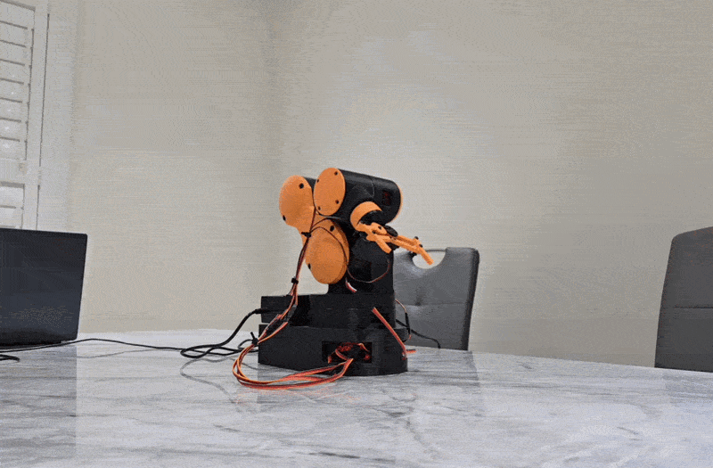

# 6-DOF-Robotic-Arm

This project contains a completed 3D-printed 6-DOF Robotic arm, complete with implementations of forward and inverse kinematics. The robotic arm contains seven servo motors (six for joints and one for the gripper), which are controlled by an Arduino Uno R3 and a PCA9685.

# Features
- Six degrees of freedom with a servo-actuated and controllable gripper
- Forward kinematics via Denavit-Hartenberg parameters and numerical inverse kinematics (IK) using the damped least squares method
- End-effector positioning by cartesian coordinates (X, Y, Z)
- Partial end-effector orientational control 

# Contents
- STEP file of the robot assembly
- Arduino/Python code for servo control and inverse/forward kinematics implementation
- Denavit-Hartenberg table used for FK and IK calculations and kinematic diagram

# Built With
- Arduino IDE
- Pyserial
- NumPy

# Demo
- This demo demonstrates the robot's capabilities in regards to accuracy and coordination. The robot stacks the cups by computing the required joint configurations in real time for a target pose that also fulfills a partial orientational constraint that aligns the wrist to be parallel with the surface of the table during the routine.

# Hardware Overview
- Servo Motor x7
- Arduino UNO R3
- PCA9685 16-channel servo driver
- Custom 3D-Printed mechanical components

# Limitations
The FK/IK pipeline does not consider the last joint (J5/Wrist Roll) in the calculations, therefore limiting possible IK solutions and requiring manual adjustment of wrist roll for specific tasks. The orientation control specified in the Python code only controls the solutions so that the robot's wrist is level with the surface, which is sufficient for pick/place tasks and writing/drawing but requires thorough path planning given the limited workspace combined with servo limits.

__A computer is required as numerical calculations do not run on the UNO.__

# License
Shield: [![CC BY 4.0][cc-by-shield]][cc-by]

This work is licensed under a
[Creative Commons Attribution 4.0 International License][cc-by].

[![CC BY 4.0][cc-by-image]][cc-by]

[cc-by]: http://creativecommons.org/licenses/by/4.0/
[cc-by-image]: https://i.creativecommons.org/l/by/4.0/88x31.png
[cc-by-shield]: https://img.shields.io/badge/License-CC%20BY%204.0-lightgrey.svg
